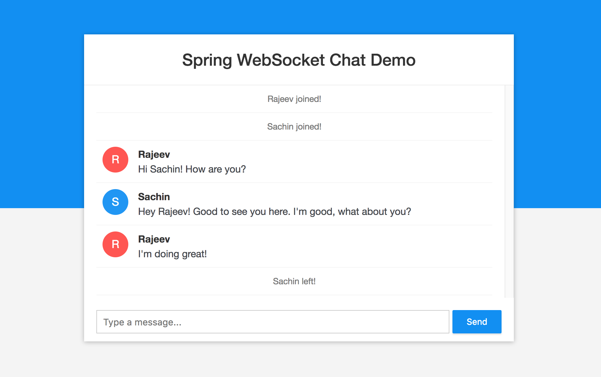

# Como Executar Essa Aplicação em Docker?
### Realizar Download da Aplicação do Git
```bash
git clone https://github.com/leonardoscorrea/docker/spring-boot-websocket-chat
```
Aproveito o momento dessa documentação para expor o workflow básico de utilização do github.

 

referencia da imagem https://www.slideshare.net/phpguru/git-101-31908275

### Definindo uma imagem Docker via Dockerfile
1. Entrando no diretório root do projeto

```bash
cd spring-boot-websocket-chat
```
2. Relizando um *touch* no dockerfile

```bash
touch Dockerfile
```

> Dockerfile é onde definimos a imagem docker que iremos usar e todas as especificações/configurações necessárias para que nossa aplicação funcione.

```bash
# Start with a base image containing Java runtime
FROM openjdk:8-jdk-alpine

# Add Maintainer Info
LABEL maintainer="leonardoscorrea@gmail.com"

# Add a volume pointing to /tmp
VOLUME /tmp

# Make port 8080 available to the world outside this container
EXPOSE 8080

# The application's jar file
ARG JAR_FILE=target/websocket-demo-0.0.1-SNAPSHOT.jar

# Add the application's jar to the container
ADD ${JAR_FILE} websocket-demo.jar

# Run the jar file 
ENTRYPOINT ["java","-Djava.security.egd=file:/dev/./urandom","-jar","/websocket-demo.jar"]

```

> ENTENDENDO O DOCKERFILE
> * FROM: a imagem docker pode usar uma imagem pai para basear-se. No caso do exemplo, utilizaremos a imagem [openjdk:8-jdk-alpine](https://hub.docker.com/_/openjdk/), que é uma imagem de Alpine Linux com OpenJDK versão 8.
> * LABEL: é utilizado pra incluir *metadados* a uma imagem docker. No caso acima foi incluído apenas o *maintainer* em nossa imagem
> * VOLUME: os volumes são mecanismos de persistências de dados utilizados para compartilhar diretórios do *Host* com o *container*. Para maiores informações sobre volumes pode se consultado a [documentação oficial](https://docs.docker.com/storage/volumes/)
> * EXPOSE: como o próprio nome sugere, é a forma de definir as portas que serão expostas para o mundo externo ao container.
> * ARG: define instruções em variáveis que tenham um valor *default*. Podemos sobrescrever o valor *default* das variáveis em tempo de *build*.
> * ADD: instrução utilizada para copiar arquivos e diretórios para dentro da imagem.
> * ENTRYPOINT: instrução que indica como a aplicação executará dentro da imagem docker.

### "*Building*" a imagem docker

Agora que entendemos a construção do *dockerfile* chegou a hora de realizarmos o *build* da nossa imagem docker. Seguindo o exemplo do *spring-boot-websocket-chat*, antes de levantarmos nossa imagem é necessário compilar nossa aplicação e para isso usaremos o comando abaixo:

```bash
mvn clean package
```

Esse comando criará o jar no diretório target, conforme definição no POM.

Agora chegou a hora de construir a imagem docker. 

```bash
docker build -t spring-boot-websocket-chat .
```

Podemos listar nossa imagem docker construída utilizando o commando abaixo

```bash
docker image ls
```


### Executando uma imagem docker

Para executar uma imagem docker já construída basta executar o comando *docker run*. Segue abaixo o exemplo

```bash
docker run -p 5000:8080 spring-boot-websocket-chat
```

Também é possível executar a imagem em *background* utilziando o parâmetro *-d* na linha de comando, bem como conferir os containers em execução 


```bash
docker run -d -p 5000:8080 spring-boot-websocket-chat
docker container ls
```

> **Para utilizar a aplicação de exemplo, basta abrir o browser de preferência e digitar a url [http://localhost:5000](http://localhost:5000)**


# Comentários Originais da Application
## Spring Boot WebSocket Chat Appplication

You can checkout the live version of the application at https://spring-ws-chat.herokuapp.com/



## Requirements

1. Java - 1.8.x

2. Maven - 3.x.x

## Steps to Setup

**1. Clone the application**

```bash
git clone https://github.com/callicoder/spring-boot-websocket-chat-demo.git
```

**2. Build and run the app using maven**

```bash
cd spring-boot-websocket-chat-demo
mvn package
java -jar target/websocket-demo-0.0.1-SNAPSHOT.jar
```

Alternatively, you can run the app directly without packaging it like so -

```bash
mvn spring-boot:run
```

## Learn More

You can find the tutorial for this application on my blog -

https://www.callicoder.com/spring-boot-websocket-chat-example/
